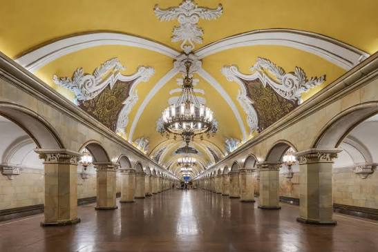

# Последний поезд — FPS в московском метро

Браузерный шутер от первого лица на **three.js r186 (WebGPU)**. Действие происходит на детально
смоделированных станциях московского метро; между волнами вы уезжаете на следующую станцию на
поезде «Москва‑2020».



## Как запустить

Игра — это статические файлы, но ES‑модули не работают при открытии `index.html` двойным щелчком,
поэтому нужен любой локальный веб‑сервер.

**Windows:** дважды щёлкните `start.bat` (нужен Python 3 или Node.js). Браузер откроется сам на
`http://localhost:8080`.

**macOS / Linux:** `./start.sh`

**Вручную:**

```bash
python -m http.server 8080      # или: npx http-server -p 8080 -c-1 .
```

Затем откройте `http://localhost:8080` в **Chrome или Edge последней версии** (WebGPU включён по
умолчанию). Нажмите «ИГРАТЬ» — мышь захватывается, `Esc` ставит паузу.

## Управление

| Клавиша | Действие |
|---|---|
| `WASD` | движение |
| Мышь / ЛКМ | обзор / огонь |
| ПКМ | прицеливание (у СВД — оптика ПСО‑1) |
| `R` | перезарядка |
| `1`–`4`, колесо | выбор оружия |
| `Shift` | бег |
| `Ctrl` / `C` | присесть |
| `Пробел` | прыжок |
| `F` | фонарь |
| `Esc` | пауза и настройки |

## Что внутри

**Станции** (строятся процедурно, без внешних моделей):
- «Комсомольская» — восьмигранные мраморные колонны с барочными капителями, жёлтый свод с белыми
  лепными рёбрами, золотая смальтовая мозаика, огромные люстры с хрусталём.
- «Маяковская» — рифлёные колонны и арки из нержавеющей стали, родонит, овальные купола с мозаикой
  «советского неба», каждый в кольце светильников.
- «Новослободская» — пилоны с витражами в золочёных рамах (подсвечены изнутри), кессонированный свод.
- Путевые стены с названием станции металлическими буквами, пути с рельсами, шпалами и контактным
  рельсом, тоннели из чугунных тюбингов с кабелями и светильниками, выходы в город.

**Разрушаемость:** каждая лампа в люстре разбивается отдельно (осколки, искры, гаснет свет, люстра
раскачивается), витражи разлетаются цветным стеклом, деревянные скамьи разваливаются на доски,
от пуль остаются сколы, пыль, крошка камня и рикошеты.

**Оружие** (модели по реальным размерам): Desert Eagle .50 (бесконечный запас магазинов),
АК‑47, помповый дробовик 12 калибра, СВД с прицелом ПСО‑1. Видимые трассеры, дульные вспышки
с освещением, отдача с подбросом ствола, анимации затвора/помпы/перезарядки, гильзы со звоном
о гранит, покачивание и инерция оружия.

**Противницы:** процедурные персонажи со скелетом и скиннингом — вечерние платья, кожаный
комбинезон, золотое платье в пайетках, белый брючный костюм «начальницы станции», красное пальто;
шпильки (цокот каблуков слышно в пространстве), макияж, серьги, очки. ИИ с поиском пути (A*),
стрельба очередями, промахи с «свистом» пуль у уха, попадания по зонам (голова ×2.5–3),
брызги крови, пятна на стенах и полу, растекающиеся лужи, ранения на теле, физика тела
(ragdoll) после смерти. Ругаются и угрожают по‑русски через синтез речи браузера (с субтитрами).

**Поезд «Москва‑2020»:** белый кузов с красной полосой и синими дугами, чёрная маска кабины
с красной окантовкой и LED‑табло следующей станции, прислонно‑сдвижные двери, салон с синими
сиденьями, поручнями и LED‑светом. Объявления «Осторожно, двери закрываются. Следующая станция…»,
звуковой сигнал, гул тяговых двигателей, стук колёс, скрип тормозов.

**Волны:** первая — простая (4 противницы, медленная реакция). После зачистки прибывает поезд;
садитесь — и он везёт вас на следующую станцию, где двери открываются прямо в засаду. С каждой
волной противниц больше, они точнее, быстрее реагируют, появляются автоматчицы и «начальницы» с
дробовиками. Игра идёт, пока вы не погибнете.

## Графика и «трассировка лучей»

Честно о RTX: аппаратная трассировка лучей (RT‑ядра) **пока не доступна из браузера** — в WebGPU
нет стандартного расширения для неё. Поэтому здесь используется максимум того, что даёт WebGPU:

- **SSR** — отражения, трассируемые лучами в экранном пространстве (полированный гранит пола
  отражает люстры и противниц);
- **SSGI** — глобальное освещение и затенение в экранном пространстве (цвет свода «переливается»
  на колонны);
- **TRAA** — временное сглаживание, **bloom**, ACES‑тонмаппинг, отражения окружения (PMREM);
- процедурные PBR‑материалы на TSL: мрамор с прожилками, гранит с кристаллами, смальта с
  наклоном каждой тессеры, пайетки, нейлон чулок, кожа, лак;
- динамическое разрешение, чтобы держать частоту кадров.

Пресеты в меню: «Ультра» (SSGI + SSR + TRAA), «Высокая», «Средняя», «Низкая». Для RTX 5070 при
1440p рекомендую «Ультра». Если WebGPU в браузере отключён или сообщит об ошибке, игра сама
перезапустится в режиме WebGL 2.

## Параметры адресной строки (для отладки)

- `?webgl` — принудительно WebGL 2
- `?q=ultra|high|medium|low` — пресет качества
- `?station=komsomolskaya|mayakovskaya|novoslobodskaya` — стартовая станция
- `?wave=N` — начать с волны N
- `?god` — неуязвимость
- `?bot&autostart&sim=20` — автопилот для проверки игрового цикла без рендера

## Технологии и лицензии

- [three.js](https://threejs.org) r186 (MIT) — `vendor/three`. В сборке WebGPU‑бэкенда убрано
  явное поле `swizzle` у дескриптора текстуры для совместимости со старыми сборками Chromium.
- [three-mesh-bvh](https://github.com/gkjohnson/three-mesh-bvh) 0.9 (MIT) — точные попадания пуль.
- Все модели, текстуры, звуки и речь генерируются кодом; внешних ассетов нет.
- `assets/ref/` — референсные фото станций и поезда (фон меню).
- Портреты в корне репозитория в игре **не используются**.
